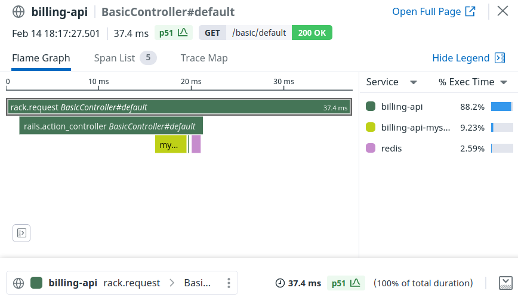
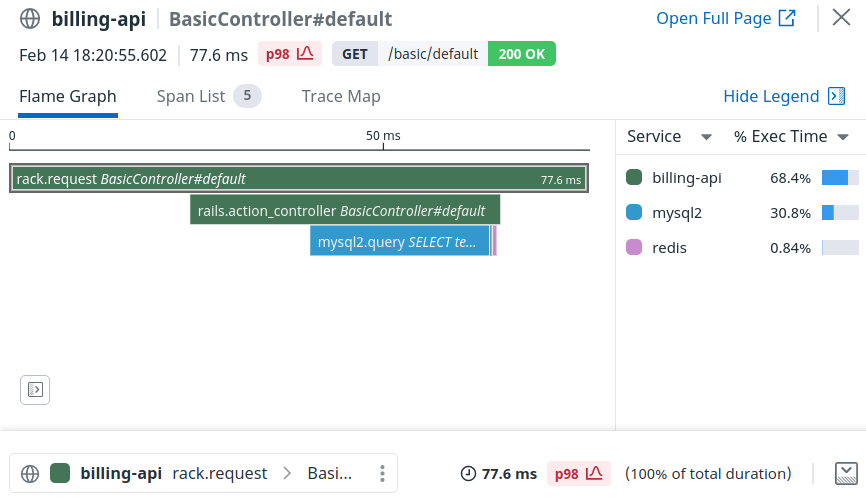

# Upgrading ddtrace

# From 0.x to 1.0

- [Namespacing & the public API](#namespacing--the-public-api)
- [Configuration](#configuration)
- [Instrumentation](#instrumentation)
- [Full list of breaking changes](#full-list-of-breaking-changes)

Upgrading `ddtrace` from 0.x to 1.x introduces some changes to namespacing, the public API, and the underlying trace data structure.

Here's a list of the most common changes you may encounter:

## Namespacing & the public API

To avoid naming conflicts with new Datadog features and products, many of the tracing constants and functions defined directly under `Datadog` have moved to `Datadog::Tracing`.

You can access most common functions through our [public API](https://www.rubydoc.info/gems/ddtrace/) within `Datadog::Tracing`. Use of some of the functions in the public API will be described in use cases below. Here's a few examples:

```ruby
### Old 0.x ###
Datadog.tracer.trace
Datadog.tracer.active_span
Datadog.tracer.active_correlation.to_s


### New 1.0 ###
Datadog::Tracing.trace
Datadog::Tracing.active_span
Datadog::Tracing.log_correlation
# ...and more...
```

Check out our [complete list of namespacing changes](#appendix-namespacing) for more details.

### Removed `Datadog.tracer`

Many of the functions accessed directly through `Datadog.tracer` have been moved to `Datadog::Tracing` instead.

### Removed access to `Datadog::Context`

Direct usage of `Datadog::Context` has been removed. Previously, it was used to modify or access active trace state. Most use cases have been replaced by our public trace API.

## Configuration

### Settings have been namespaced

Configuration settings have been sorted into smaller configuration groups, by product.

 - `Datadog.configure { |c| c.* }`: Datadog configuration settings
 - `Datadog.configure { |c| c.tracing.* }`: Tracing configuration settings
 - `Datadog.configure { |c| c.profiling.* }`: Profiling configuration settings
 - `Datadog.configure { |c| c.ci.* }`: CI configuration settings

Existing applications should update their configuration files and settings accordingly. For example:

```ruby
# config/initializers/datadog.rb
require 'ddtrace'

### Old 0.x ###
Datadog.configure do |c|
  # Global settings
  c.diagnostics.debug = true
  c.service = 'billing-api'

  # Profiling settings
  c.profiling.enabled = true

  # Tracer settings
  c.analytics.enabled = true
  c.runtime_metrics.enabled = true
  c.tracer.hostname = '127.0.0.1'
  c.tracer.port = 8126

  # CI settings
  c.ci_mode = (ENV['DD_ENV'] == 'ci')

  # Instrumentation
  c.use :rails
  c.use :redis, service_name: 'billing-redis'
  c.use :resque
  c.use :rspec
end


### New 1.0 ###
Datadog.configure do |c|
  # Global settings
  c.agent.hostname = '127.0.0.1'
  c.agent.port = 8126
  c.diagnostics.debug = true
  c.service = 'billing-api'

  # Profiling settings
  c.profiling.enabled = true

  # Tracer settings
  c.tracing.analytics.enabled = true
  
  # Runtime metrics settings
  c.runtime_metrics.enabled = true

  # CI settings
  c.ci.enabled = (ENV['DD_ENV'] == 'ci')

  # Instrumentation
  c.tracing.instrument :rails
  c.tracing.instrument :redis, service_name: 'billing-redis'
  c.tracing.instrument :resque
  c.ci.instrument :rspec
end
```

Check out our [complete list of configuration changes](#appendix-configuration) for more details.

### Activating instrumentation

The `use` function has been renamed to `instrument`. Also, `instrument` has been namespaced to the specific product:

```ruby
### Old 0.x ###
Datadog.configure do |c|
  c.use :rails
  c.use :cucumber
end


### New 1.0 ###
Datadog.configure do |c|
  c.tracing.instrument :rails
  c.ci.instrument :cucumber
end
```

## Instrumentation

### Service naming

In 0.x, The `service` field on spans generated by Datadog integrations would typically default to the package name, e.g. `http` or `sidekiq`. This would often result in many "services" being generated by one application, one for each instrumented package. Users would often rectify this by overriding the `service_name` setting on each integration to get matching `service` names.

To remedy this in later 0.x versions, we introduced the global `service` name setting (also set via `DD_SERVICE`), which is the recommended way to set the name of your application. However, the Datadog integrations (with the exception of Rails) still did not employ this field.

In 1.0, spans now inherit the global `service` name by default, unless otherwise explicitly set. This means for spans generated by Datadog integrations, they will default to the global `service` name, unless the `service_name` setting is configured for that integration.

Spans that describe external services (e.g. `mysql`), will default to some other name that describes the external service instead.

As an example, expect the following code & trace in 0.x:

```ruby
### Old 0.x ###
Datadog.configure do |c|
  c.service = 'billing-api'
  c.use :rails
  c.use :redis
  c.use :resque
end
```



To reflect the following trace in 1.0 instead:

```ruby
### New 1.0 ###
Datadog.configure do |c|
  c.service = 'billing-api'
  c.tracing.instrument :rails
  c.tracing.instrument :redis
  c.tracing.instrument :resque
end
```



### Manual tracing & trace model

Manual tracing is now done through the public API.

Whereas in 0.x, the block would yield a `Datadog::Span` as `span`, in 1.0, the block yields a `Datadog::SpanOperation` as `span` and `Datadog::TraceOperation` as `trace`.

```ruby
### Old 0.x ###
Datadog.tracer.trace('my.job') do |span|
  # Do work...
  # span => #<Datadog::Tracing::Span>
end


### New 1.0 ###
Datadog::Tracing.trace('my.job') do |span, trace|
  # Do work...
  # span => #<Datadog::Tracing::SpanOperation>
  # trace => #<Datadog::Tracing::TraceOperation>
end
```

The yielded `span` is nearly identical in behavior, except access to some fields (like `context`) been removed. Instead, the `trace`, which models the trace itself, grants access to new functions.

For more details about new behaviors and the trace model, see [this pull request](https://github.com/DataDog/dd-trace-rb/pull/1783).

### Accessing trace state

The public API provides new functions to access active trace data:

```ruby
### Old 0.x ###
# Retuns the active context (contains trace state)
Datadog.tracer.call_context
# Returns the active Span
Datadog.tracer.active_span
# Returns an immutable set of identifiers for the current trace state
Datadog.tracer.active_correlation


### New 1.0 ###
# Retuns the active TraceOperation for the current thread (contains trace state)
Datadog::Tracing.active_trace
# Returns the active SpanOperation for the current thread (contains span state)
Datadog::Tracing.active_span
# Returns an immutable set of identifiers for the current trace state
Datadog::Tracing.correlation
```

Use of `active_root_span` has been removed.

### Distributed tracing

Previously, distributed tracing required building new `Datadog::Context` objects, then replacing the context within the tracer.

Instead, users utilize `TraceDigest` objects derived from a trace. This object represents the state of a trace. It can be used to propagate a trace across execution boundaries (processes, threads), or to continue a trace locally.

```ruby
### Old 0.x ###
# Get trace continuation from active trace
env = {}
Datadog::HTTPPropagator.inject(Datadog.tracer.call_context, env)
context = Datadog::HTTPPropagator.extract(env)

# Continue a trace: implicit continuation
Datadog.tracer.provider.context = context

# Next trace inherits trace properties
Datadog.tracer.trace('my.job') do |span|
  span.trace_id == context.trace_id
end


### New 1.0 ###
# Get trace continuation from active trace
trace_digest = Datadog::Tracing.active_trace.to_digest

# Continue a trace: explicit continuation
# Inherits trace properties from the trace digest
Datadog::Tracing.trace('my.job', continue_from: trace_digest) do |span, trace|
  trace.id == trace_digest.trace_id
end

# Continue a trace: implicit continuation
# Digest will be "consumed" by the next `trace` operation
Datadog::Tracing.continue_trace!(trace_digest)

# Next trace inherits trace properties
Datadog::Tracing.trace('my.job') do |span, trace|
  trace.id == trace_digest.trace_id
end

# Second trace does NOT inherit trace properties
Datadog::Tracing.trace('my.job') do |span, trace|
  trace.id != trace_digest.trace_id
end
```

#### Propagation over HTTP/gRPC

To propagate a local trace to a remote service:

```ruby
### Old 0.x ###
context = Datadog.tracer.call_context

# HTTP
headers = {}
Datadog::HTTPPropagator.inject!(context, headers)
# Inject `headers` into your HTTP headers

# gRPC
headers = {}
Datadog::GRPCPropagator.inject!(context, headers)
# Inject `headers` into your headers


### New 1.0 ###
trace_digest = Datadog::Tracing.active_trace.to_digest

# HTTP
headers = {}
Datadog::Tracing::Propagation::HTTP.inject!(trace_digest, headers)
# Inject `headers` into your HTTP headers

# gRPC
headers = {}
Datadog::Tracing::Propagation::GRPC.inject!(trace_digest, headers)
# Inject `headers` into your headers
```

To continue a propagated trace locally:

```ruby
### Old 0.x ###
# HTTP
context = Datadog::HTTPPropagator.extract(request.env)
Datadog.tracer.provider.context = context

# gRPC
context = Datadog::GRPCPropagator.extract(metadata)
Datadog.tracer.provider.context = context

### New 1.0 ###
# HTTP
digest = Datadog::Tracing::Propagation::HTTP.extract(request.env)
Datadog::Tracing.continue_trace!(digest)

# gRPC
digest = Datadog::Tracing::Propagation::GRPC.extract(metadata)
Datadog::Tracing.continue_trace!(digest)
```

#### Propagation between threads

Traces do not implicitly propagate across threads, as they are considered different execution contexts.

However, if you wish to do this, trace propagation across threads is similar to cross-process. A `TraceDigest` should be produced by the parent thread and consumed by the child thread.

NOTE: The same `TraceOperation` object should never be shared between threads; this would create race conditions.

```ruby
# Get trace digest
trace = Datadog::Tracing.active_trace

# NOTE: We must produce the digest BEFORE starting the thread.
#       Otherwise if it's lazily evaluated within the thread,
#       the thread's trace may follow the wrong parent span.
trace_digest = trace.to_digest

Thread.new do
  # Inherits trace properties from the trace digest
  Datadog::Tracing.trace('my.job', continue_from: trace_digest) do |span, trace|
    trace.id == trace_digest.trace_id
  end
end
```

### Sampling

Accessing `call_context` to set explicit sampling has been removed.

Instead, use the `TraceOperation` to set the sampling decision.

```ruby
### Old 0.x ###
# From within the trace:
Datadog.tracer.trace('web.request') do |span|
  span.context.sampling_priority = Datadog::Ext::Priority::USER_REJECT if env.path == '/healthcheck'
end

# From outside the trace:
Datadog.tracer.active_span.context.sampling_priority = Datadog::Ext::Priority::USER_KEEP # Keeps current trace
Datadog.tracer.active_span.context.sampling_priority = Datadog::Ext::Priority::USER_REJECT # Drops current trace


### New 1.0 ###
# From within the trace:
Datadog::Tracing.trace('web.request') do |span, trace|
  trace.reject! if env.path == '/healthcheck'
end

# From outside the trace:
Datadog::Tracing.keep! # Keeps current trace
Datadog::Tracing.reject! # Drops current trace
```

### Processing pipeline

When using a trace processor in the processing pipeline, the block yields a `TraceSegment` as `trace` instead of `Array[Datadog::Span]`. This object can be modified by reference.

```ruby
### Old 0.x ###
Datadog::Pipeline.before_flush do |trace|
  # Processing logic...
  trace # => Array[Datadog::Span]
end


### New 1.0 ###
Datadog::Tracing.before_flush do |trace|
   # Processing logic...
   trace # => #<Datadog::Tracing::TraceSegment>
end
```

## Appendix

<h3 id="appendix-namespacing">Namespacing</h3>

#### `require` paths

| `0.x require path`          | `1.0 require path`          |
|-----------------------------|-----------------------------|
| `ddtrace/opentelemetry`     | `datadog/opentelemetry`     |
| `ddtrace/opentracer`        | `datadog/opentracer`        |
| `ddtrace/profiling/preload` | `datadog/profiling/preload` |


#### Constants

| `0.x Constant`                                                  | `1.0 Constant`                                                                          |
|-----------------------------------------------------------------|-----------------------------------------------------------------------------------------|
| `Datadog::AllSampler`                                           | `Datadog::Tracing::Sampling::AllSampler`                                                |
| `Datadog::Buffer`                                               | `Datadog::Core::Buffer::Random`                                                         |
| `Datadog::Chunker`                                              | `Datadog::Core::Chunker`                                                                |
| `Datadog::Configuration`                                        | `Datadog::Core::Configuration`                                                          |
| `Datadog::ContextFlush`                                         | `Datadog::Tracing::Flush`                                                               |
| `Datadog::CRubyBuffer`                                          | `Datadog::Core::Buffer::CRuby`                                                          |
| `Datadog::Diagnostics`                                          | `Datadog::Core::Diagnostics`                                                            |
| `Datadog::DistributedTracing`                                   | `Datadog::Tracing::Distributed`                                                         |
| `Datadog::Encoding`                                             | `Datadog::Core::Encoding`                                                               |
| `Datadog::Error`                                                | `Datadog::Core::Error`                                                                  |
| `Datadog::Ext::Analytics::ENV_TRACE_ANALYTICS_ENABLED`          | `Datadog::Tracing::Configuration::Ext::Analytics::ENV_TRACE_ANALYTICS_ENABLED`          |
| `Datadog::Ext::Analytics`                                       | `Datadog::Tracing::Metadata::Ext::Analytics`                                            |
| `Datadog::Ext::AppTypes`                                        | `Datadog::Tracing::Metadata::Ext::AppTypes`                                             |
| `Datadog::Ext::Correlation::ENV_LOGS_INJECTION_ENABLED`         | `Datadog::Tracing::Configuration::Ext::Correlation::ENV_LOGS_INJECTION_ENABLED`         |
| `Datadog::Ext::Correlation`                                     | `Datadog::Tracing::Correlation::Identifier`                                             |
| `Datadog::Ext::Diagnostics`                                     | `Datadog::Core::Diagnostics::Ext`                                                       |
| `Datadog::Ext::Distributed::ENV_PROPAGATION_STYLE_EXTRACT`      | `Datadog::Tracing::Configuration::Ext::Distributed::ENV_PROPAGATION_STYLE_EXTRACT`      |
| `Datadog::Ext::Distributed::ENV_PROPAGATION_STYLE_INJECT`       | `Datadog::Tracing::Configuration::Ext::Distributed::ENV_PROPAGATION_STYLE_INJECT`       |
| `Datadog::Ext::Distributed::PROPAGATION_STYLE_B3_SINGLE_HEADER` | `Datadog::Tracing::Configuration::Ext::Distributed::PROPAGATION_STYLE_B3_SINGLE_HEADER` |
| `Datadog::Ext::Distributed::PROPAGATION_STYLE_B3`               | `Datadog::Tracing::Configuration::Ext::Distributed::PROPAGATION_STYLE_B3`               |
| `Datadog::Ext::Distributed::PROPAGATION_STYLE_DATADOG`          | `Datadog::Tracing::Configuration::Ext::Distributed::PROPAGATION_STYLE_DATADOG`          |
| `Datadog::Ext::Distributed`                                     | `Datadog::Tracing::Metadata::Ext::Distributed`                                          |
| `Datadog::Ext::DistributedTracing::TAG_ORIGIN`                  | `Datadog::Tracing::Metadata::Ext::Distributed::TAG_ORIGIN`                              |
| `Datadog::Ext::DistributedTracing::TAG_SAMPLING_PRIORITY`       | `Datadog::Tracing::Metadata::Ext::Distributed::TAG_SAMPLING_PRIORITY`                   |
| `Datadog::Ext::DistributedTracing`                              | `Datadog::Tracing::Distributed::Headers::Ext`                                           |
| `Datadog::Ext::Environment`                                     | `Datadog::Core::Environment::Ext`                                                       |
| `Datadog::Ext::Errors`                                          | `Datadog::Tracing::Metadata::Ext::Errors`                                               |
| `Datadog::Ext::Git`                                             | `Datadog::Core::Git::Ext`                                                               |
| `Datadog::Ext::HTTP`                                            | `Datadog::Tracing::Metadata::Ext::HTTP`                                                 |
| `Datadog::Ext::Integration`                                     | `Datadog::Tracing::Metadata::Ext`                                                       |
| `Datadog::Ext::NET::ENV_REPORT_HOSTNAME`                        | `Datadog::Tracing::Configuration::Ext::NET::ENV_REPORT_HOSTNAME`                        |
| `Datadog::Ext::NET`                                             | `Datadog::Tracing::Metadata::Ext::NET`                                                  |
| `Datadog::Ext::Priority`                                        | `Datadog::Tracing::Sampling::Ext::Priority`                                             |
| `Datadog::Ext::Runtime`                                         | `Datadog::Core::Runtime::Ext`                                                           |
| `Datadog::Ext::Sampling::ENV_RATE_LIMIT`                        | `Datadog::Tracing::Configuration::Ext::Sampling::ENV_RATE_LIMIT`                        |
| `Datadog::Ext::Sampling::ENV_SAMPLE_RATE`                       | `Datadog::Tracing::Configuration::Ext::Sampling::ENV_SAMPLE_RATE`                       |
| `Datadog::Ext::Sampling`                                        | `Datadog::Tracing::Metadata::Ext::Sampling`                                             |
| `Datadog::Ext::SQL`                                             | `Datadog::Tracing::Metadata::Ext::SQL`                                                  |
| `Datadog::Ext::Test`                                            | `Datadog::Tracing::Configuration::Ext::Test`                                            |
| `Datadog::Ext::Transport::HTTP::ENV_DEFAULT_HOST`               | `Datadog::Tracing::Configuration::Ext::Transport::ENV_DEFAULT_HOST`                     |
| `Datadog::Ext::Transport::HTTP::ENV_DEFAULT_PORT`               | `Datadog::Tracing::Configuration::Ext::Transport::ENV_DEFAULT_PORT`                     |
| `Datadog::Ext::Transport::HTTP::ENV_DEFAULT_URL`                | `Datadog::Tracing::Configuration::Ext::Transport::ENV_DEFAULT_URL`                      |
| `Datadog::Ext::Transport`                                       | `Datadog::Transport::Ext`                                                               |
| `Datadog::GRPCPropagator`                                       | `Datadog::Tracing::Propagation::GRPC`                                                   |
| `Datadog::HTTPPropagator`                                       | `Datadog::Tracing::Propagation::HTTP`                                                   |
| `Datadog::Logger`                                               | `Datadog::Core::Logger`                                                                 |
| `Datadog::Metrics`                                              | `Datadog::Core::Metrics::Client`                                                        |
| `Datadog::PrioritySampler`                                      | `Datadog::Tracing::Sampling::PrioritySampler`                                           |
| `Datadog::Quantization`                                         | `Datadog::Contrib::Utils::Quantization`                                                 |
| `Datadog::RateByKeySampler`                                     | `Datadog::Tracing::Sampling::RateByKeySampler`                                          |
| `Datadog::RateByServiceSampler`                                 | `Datadog::Tracing::Sampling::RateByServiceSampler`                                      |
| `Datadog::RateSampler`                                          | `Datadog::Tracing::Sampling::RateSampler`                                               |
| `Datadog::Runtime`                                              | `Datadog::Core::Runtime`                                                                |
| `Datadog::Sampler`                                              | `Datadog::Tracing::Sampling::Sampler`                                                   |
| `Datadog::Tagging::Analytics`                                   | `Datadog::Tracing::Metadata::Analytics`                                                 |
| `Datadog::Tagging::Metadata`                                    | `Datadog::Tracing::Metadata::Tagging`                                                   |
| `Datadog::ThreadSafeBuffer`                                     | `Datadog::Core::Buffer::ThreadSafe`                                                     |
| `Datadog::Utils`                                                | `Datadog::Core::Utils`                                                                  |
| `Datadog::Vendor::ActiveRecord`                                 | `Datadog::Contrib::ActiveRecord::Vendor`                                                |
| `Datadog::Vendor::Multipart`                                    | `Datadog::Core::Vendor::Multipart`                                                      |
| `Datadog::Worker`                                               | `Datadog::Core::Worker`                                                                 |
| `Datadog::Workers`                                              | `Datadog::Core::Workers`                                                                |


<h3 id="appendix-configuration">Configuration</h3>

| 0.x setting                            | 1.0 setting                   |
|----------------------------------------|-------------------------------|
| `analytics.enabled`                    | `tracing.analytics.enabled`   |
| `ci_mode.context_flush`                | `ci.context_flush`            |
| `ci_mode.enabled`                      | `ci.enabled`                  |
| `ci_mode.writer_options`               | `ci.writer_options`           |
| `distributed_tracing`                  | `tracing.distributed_tracing` |
| `logger=`                              | `logger.instance=`            |
| `profiling.exporter.transport_options` | Removed                       |
| `report_hostname`                      | `tracing.report_hostname`     |
| `runtime_metrics_enabled`              | `runtime_metrics.enabled`     |
| `runtime_metrics(options)`             | Removed                       |
| `sampling`                             | `tracing.sampling`            |
| `test_moade`                           | `tracing.test_mode`           |
| `tracer.enabled`                       | `tracing.enabled`             |
| `tracer.hostname`                      | `agent.hostname`              |
| `tracer.instance`                      | `tracing.instance`            |
| `tracer.partial_flush`                 | `tracing.partial_flush`       |
| `tracer.port`                          | `agent.port`                  |
| `tracer.sampler`                       | `tracing.sampler`             |
| `tracer.transport_options`             | `tracing.transport_options`   |
| `tracer.transport_options(options)`    | Removed                       |
| `tracer.writer`                        | `tracing.writer`              |
| `tracer.writer_options`                | `tracing.writer_options`      |

<h3 id="appendix-breaking-changes">Breaking changes</h3>

| **Category**  | **Type** | **Description**                                                                                                      | **Change / Alternative**                                                                                                                                                  |
|---------------|----------|----------------------------------------------------------------------------------------------------------------------|---------------------------------------------------------------------------------------------------------------------------------------------------------------------------|
| General       | Changed  | Many constants have been moved from `Datadog` to `Datadog::Core`, `Datadog::Tracing`, `Datadog::Profiling`           | Update your references to these [new namespaces](#appendix-namespacing) where appropriate.                                                                                |
| General       | Removed  | `Datadog.tracer`                                                                                                     | Use methods in `Datadog::Tracing` instead.                                                                                                                                |
| General       | Removed  | Support for trace agent API v0.2                                                                                     | Use v0.4 instead (default behavior.)                                                                                                                                      |
| CI API        | Changed  | `DD_TRACE_CI_MODE_ENABLED` environment variable is now `DD_TRACE_CI_ENABLED`                                         | Use `DD_TRACE_CI_ENABLED` instead.                                                                                                                                        |
| Configuration | Changed  | Many settings have been namespaced under specific categories                                                         | Update your configuration to these [new settings](#appendix-configuration) where appropriate.                                                                             |
| Configuration | Removed  | `Datadog.configure(client, options)`                                                                                 | Use `Datadog::Tracing.configure_onto(client, options)` instead.                                                                                                           |
| Configuration | Removed  | `DD_#{integration}_ANALYTICS_ENABLED` and `DD_#{integration}_ANALYTICS_SAMPLE_RATE` environment variables            | Use `DD_TRACE_#{integration}_ANALYTICS_ENABLED` and `DD_TRACE_#{integration}_ANALYTICS_SAMPLE_RATE` instead.                                                              |
| Configuration | Removed  | `DD_PROPAGATION_INJECT_STYLE` and `DD_PROPAGATION_EXTRACT_STYLE` environment variables                               | Use `DD_PROPAGATION_STYLE_INJECT` and `DD_PROPAGATION_STYLE_EXTRACT` instead.                                                                                             |
| Integrations  | Changed  | `-` in HTTP header tag names are kept, and no longer replaced with `_`                                               | For example: `http.response.headers.content_type` is changed to `http.response.headers.content-type`.                                                                     |
| Integrations  | Changed  | `Contrib::Configurable#default_configuration` moved to `Tracing::Contrib::Configurable#new_configuration`            | Use `Tracing::Contrib::Configurable#new_configuration` instead.                                                                                                           |
| Integrations  | Changed  | `Datadog.configuration.registry` moved to `Datadog.registry`                                                         | Use `Datadog.registry` instead.                                                                                                                                           |
| Integrations  | Changed  | `service_name` option from each integration uses the default service name, unless it represents an external service  | Set `c.service` or `DD_SERVICE`, and remove `service_name` option from integration to inherit default service name. Set `service_name` option on integration to override. |
| Integrations  | Changed  | Presto: `out.host` tag now contains only client hostname. Before it contained `"#{hostname}:#{port}"`.               |                                                                                                                                                                           |
| Integrations  | Changed  | Rails: service_name does not propagate to sub-components (e.g. `c.use :rails, cache_service: 'my-cache'`)            | Use `c.service` instead.                                                                                                                                                  |
| Integrations  | Changed  | Rails: Sub-components service_name options are now consistently called `:service_name`                               | Update your configuration to use `:service_name`.                                                                                                                         |
| Integrations  | Changed  | Rails: Trace-logging correlation is enabled by default                                                               | Can be disabled using the environment variable `DD_LOGS_INJECTION=false`.                                                                                                 |
| Integrations  | Removed  | `tracer` integration option from all integrations                                                                    | Remove this option from your configuration.                                                                                                                               |
| Integrations  | Removed  | ActiveJob: `log_injection` option                                                                                    | Use `c.tracing.log_injection` instead.                                                                                                                                    |
| Integrations  | Removed  | ActiveModelSerializers: service_name configuration                                                                   | Remove this option from your configuration.                                                                                                                               |
| Integrations  | Removed  | ConcurrentRuby: unused option `service_name`                                                                         | Remove this option from your configuration.                                                                                                                               |
| Integrations  | Removed  | Rails: 3.0 and 3.1 support.                                                                                          | Not supported.                                                                                                                                                            |
| Integrations  | Removed  | Rails: `log_injection` option.                                                                                       | Use global `c.tracing.log_injection` instead.                                                                                                                             |
| Integrations  | Removed  | Rails: `orm_service_name` option.                                                                                    | Remove this option from your configuration.                                                                                                                               |
| Integrations  | Removed  | Resque: `workers` option. (All Resque workers are now automatically instrumented.)                                   | Remove this option from your configuration.                                                                                                                               |
| Tracing API   | Changed  | `Correlation#to_s` to `Correlation#to_log_format`                                                                    | Use `Datadog::Tracing.log_correlation` instead.                                                                                                                           |
| Tracing API   | Changed  | `Tracer#trace` implements keyword args                                                                               | Omit invalid options from `trace` calls.                                                                                                                                  |
| Tracing API   | Changed  | Distributed tracing takes and yields `TraceDigest` instead of `Context`                                              | Update your usage of distributed tracing to use `continue_from` and `to_digest`.                                                                                          |
| Tracing API   | Changed  | Rules for RuleSampler now yield `TraceOperation` instead of `Span`                                                   | Update Rule sampler usage to use `TraceOperation`.                                                                                                                        |
| Tracing API   | Changed  | Trace processors yield `TraceSegment` instead of `Array[Span]`                                                       | Update pipeline callbacks to use `TraceSegment instead.                                                                                                                   |
| Tracing API   | Removed  | `child_of:` option from `Tracer#trace`                                                                               | Not supported.                                                                                                                                                            |
| Tracing API   | Removed  | `Pin.new(service, config: { option: value }).onto(client)`                                                           | Use `Datadog::Tracing.configure_onto(client, service_name: service, option: value)` instead.                                                                              |
| Tracing API   | Removed  | `Pin.get_from(client)`                                                                                               | Use `Datadog::Tracing.configure_for(client)` instead.                                                                                                                     |
| Tracing API   | Removed  | `Pipeline.before_flush`                                                                                              | Use `Datadog::Tracing.before_flush` instead.                                                                                                                              |
| Tracing API   | Removed  | `SpanOperation#context`                                                                                              | Use `Datadog::Tracing.active_trace` instead.                                                                                                                              |
| Tracing API   | Removed  | `SpanOperation#parent`/`SpanOperation#parent=`                                                                       | Not supported.                                                                                                                                                            |
| Tracing API   | Removed  | `SpanOperation#sampled`                                                                                              | Use `Datadog::TraceOperation#sampled?` instead.                                                                                                                           |
| Tracing API   | Removed  | `Tracer#active_correlation`                                                                                          | Use `Datadog::Tracing.correlation` instead.                                                                                                                               |
| Tracing API   | Removed  | `Tracer#active_correlation.to_log_format`                                                                            | Use `Datadog::Tracing.log_correlation` instead.                                                                                                                           |
| Tracing API   | Removed  | `Tracer#active_root_span`                                                                                            | Use `Datadog::Tracing.active_trace` instead.                                                                                                                              |
| Tracing API   | Removed  | `Tracer#build_span`                                                                                                  | Use `Datadog::Tracing.trace` instead.                                                                                                                                     |
| Tracing API   | Removed  | `Tracer#call_context`                                                                                                | Use `Datadog::Tracing.active_trace` instead.                                                                                                                              |
| Tracing API   | Removed  | `Tracer#configure`                                                                                                   | Not supported.                                                                                                                                                            |
| Tracing API   | Removed  | `Tracer#services`                                                                                                    | Not supported.                                                                                                                                                            |
| Tracing API   | Removed  | `Tracer#set_service_info`                                                                                            | Not supported.                                                                                                                                                            |
| Tracing API   | Removed  | `Tracer#start_span`                                                                                                  | Use `Datadog::Tracing.trace` instead.                                                                                                                                     |
| Tracing API   | Removed  | `Writer#write` and `SyncWriter#write` `services` argument                                                            | Not supported.                                                                                                                                                            |
